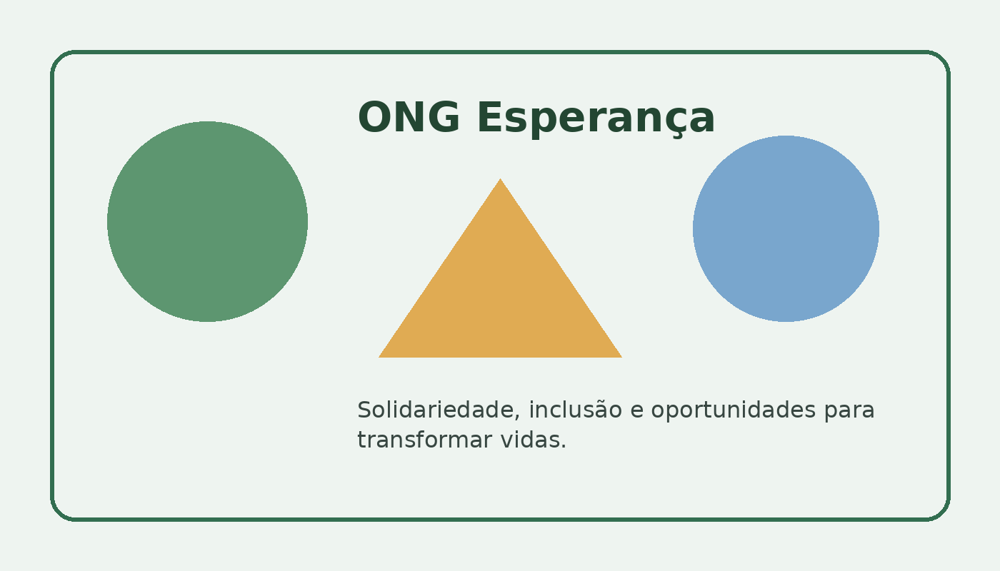

# 🌱 Projeto Novo Futuro

Projeto acadêmico de desenvolvimento Front-End para uma plataforma
voltada a projetos sociais, doações e voluntariado.



## 📌 Sobre o projeto

O **Novo Futuro** é uma proposta de plataforma digital criada para
facilitar a divulgação de projetos sociais e aproximar pessoas
interessadas em contribuir com ações de impacto social.

O projeto foi desenvolvido como atividade acadêmica, aplicando
conceitos de desenvolvimento Web, HTML semântico, acessibilidade
e organização de projetos utilizando Git e GitHub.

## 🎯 Objetivos

- Divulgar projetos e iniciativas sociais;
- Facilitar o acesso a informações sobre ações voluntárias;
- Incentivar a participação da comunidade;
- Criar uma interface simples e acessível;
- Aplicar boas práticas de desenvolvimento Front-End.

## 💻 Tecnologias utilizadas

- HTML5
- CSS
- JavaScript
- Git
- GitHub
- Visual Studio Code

## 📂 Estrutura do projeto

```text
projeto-ong-novo-mundo/
│
├── imagens/
│   └── imagens utilizadas no projeto
│
├── scripts/
│   └── arquivos JavaScript
│
├── cadastro.html
├── index.html
├── projetos.html
├── .gitignore
├── LICENSE
└── README.md

 ```
 `## 🌐 Projeto online`

O projeto está disponível para acesso através do GitHub Pages.

👉 [Acesse o projeto online](https://marcalcunha.github.io/projeto-ong-novo-mundo/)

## 📚 Contexto acadêmico

Este projeto foi desenvolvido como parte das atividades acadêmicas do curso de Engenharia de Software, com o objetivo de aplicar na prática conceitos de desenvolvimento Front-End, organização de projetos e utilização do Git e GitHub.

## 🎓 Aprendizados

Durante o desenvolvimento do projeto, foram praticados:

- Estruturação de páginas utilizando HTML5;
- Organização e estilização de interfaces;
- Utilização de JavaScript;
- Organização de arquivos e diretórios;
- Versionamento de código com Git;
- Utilização do GitHub;
- Publicação de um projeto utilizando GitHub Pages;
- Desenvolvimento de uma solução com foco social e acessibilidade.

## 🚀 Status do projeto

🟢 Projeto acadêmico concluído e publicado para demonstração.

## 👨‍💻 Autor

**Marçal Costa Cunha**

Estudante de Engenharia de Software

Projeto desenvolvido para fins acadêmicos e de portfólio.

---


